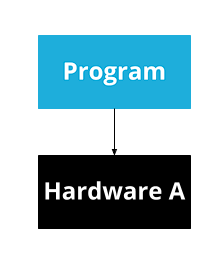
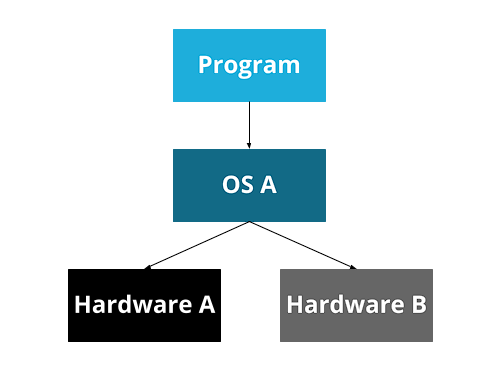
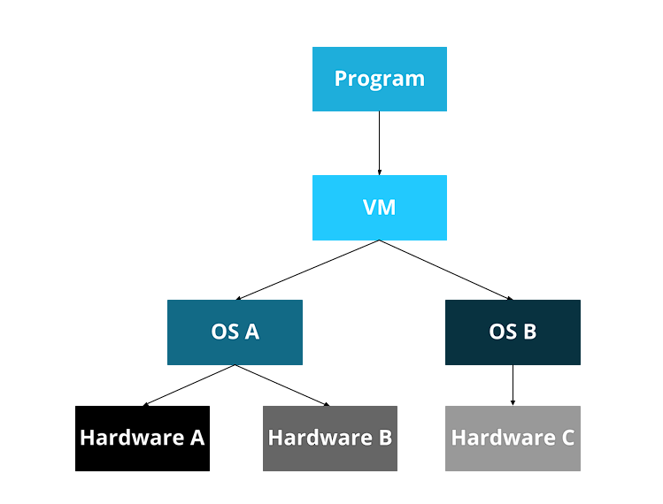

# What is and OS?

```
  An operating system is a program that provides a platform for other programs. It provides two things to these programs: abstraction and isolation
```
this is not the complete definition, but is worth for now.

## Creating abstractions

One of the reasons to create a platform for other programs is to abstract programs over hardware.

Consider a program running on some hardware:



To make this program available to other computers an not only the first one, we need to make an abstraction of the hardware, and make a middleman between the program and the hardware.



Now the OS can handle the details of the hardware and provide and API for the program.

